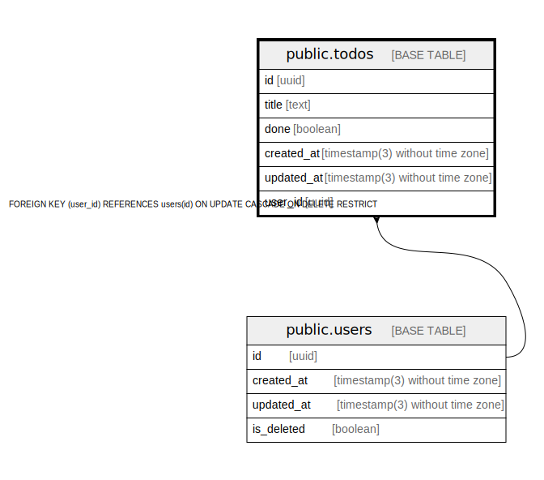

# public.todos

## Description

## Columns

| Name | Type | Default | Nullable | Children | Parents | Comment |
| ---- | ---- | ------- | -------- | -------- | ------- | ------- |
| id | uuid | gen_random_uuid() | false |  |  |  |
| title | text | ''::text | false |  |  |  |
| done | boolean | false | false |  |  |  |
| created_at | timestamp(3) without time zone | CURRENT_TIMESTAMP | false |  |  |  |
| updated_at | timestamp(3) without time zone | CURRENT_TIMESTAMP | false |  |  |  |
| user_id | uuid |  | false |  | [public.users](./public.users) |  |

## Constraints

| Name | Type | Definition |
| ---- | ---- | ---------- |
| todos_user_id_fkey | FOREIGN KEY | FOREIGN KEY (user_id) REFERENCES users(id) ON UPDATE CASCADE ON DELETE RESTRICT |
| todos_pkey | PRIMARY KEY | PRIMARY KEY (id) |

## Indexes

| Name | Definition |
| ---- | ---------- |
| todos_pkey | CREATE UNIQUE INDEX todos_pkey ON public.todos USING btree (id) |
| todos_user_id_idx | CREATE INDEX todos_user_id_idx ON public.todos USING btree (user_id) |

## Relations

---

> Generated by [tbls](https://github.com/k1LoW/tbls)
